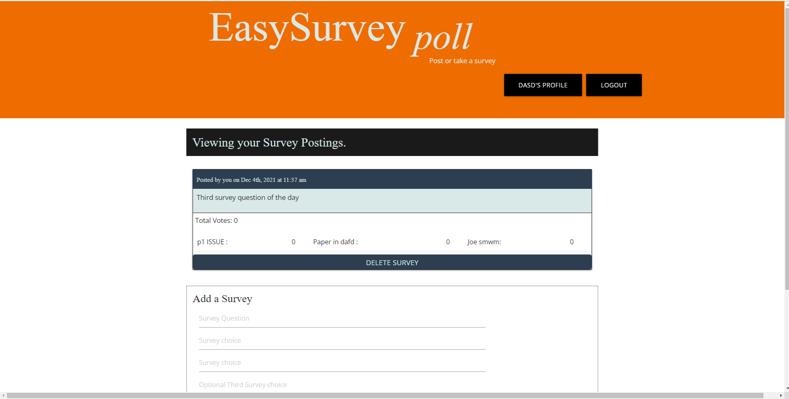
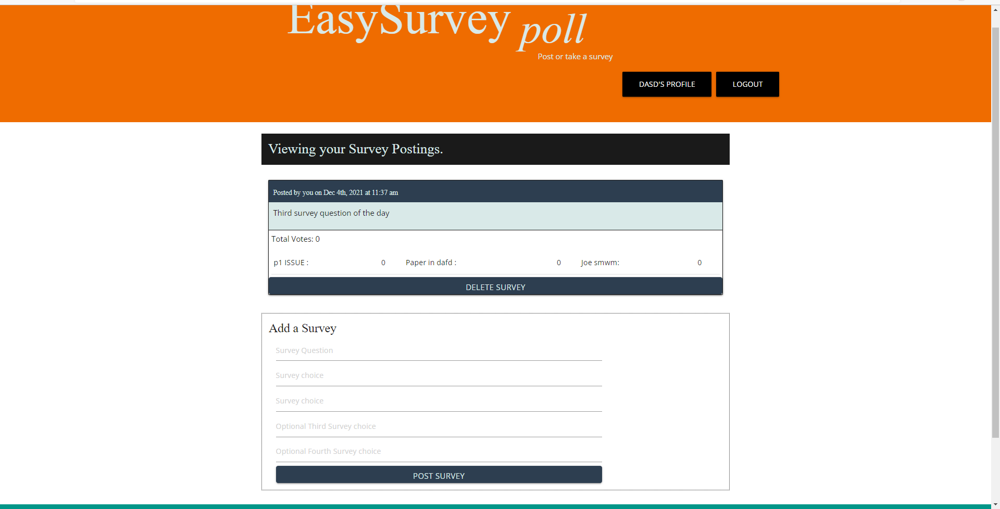

# Group Project 6: Survey Web application

The survey web app was built using the MERN stack with a React front end, MongoDB database, and Node.js/Express.js server and API. It's set up to allow users to post surveys on any topic and take surveys. For each display it shows the number of people that voted and their choice. The initial application only allow for surveys with up to 4 answers for user to use.  A minimum of two answers is required per survey. 

### 

An Apollo Server was setup to use GraphQL queries and mutations to fetch and modify data. No rest Api was used for this project. 
In this application the authentication middleware is setup to work in the context of a GraphQL API. An Apollo Provider was added so that requests can communicate with an Apollo Server.

### 
The application was deployed to Heroku with a MongoDB database using MongoDB Atlas. 

###
A user needs to signup on the application in order to post or take a survey. After login the user could access all their surveys and delete them if needed, by using the delete button.
The homepage shows a login/signup option for the user to login or signup after he clicks on the button. For the signup form the user needs a name, a valid email, and a password as inputs.
After signup using the submit button, the user is logged in and presented with option to logout , post or take surveys.
The login form allows a user to login using his email and password.

### Various links showing various application pages

Heroku deployed URL: 
Application GitHub URL : 

Home Page Screen Shot : 
User Page Screen Shot : 